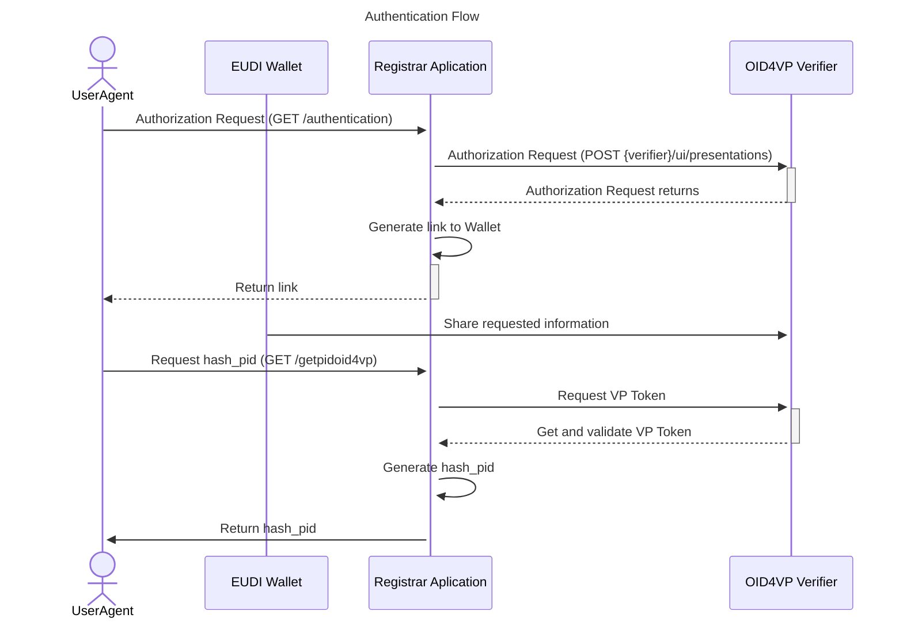
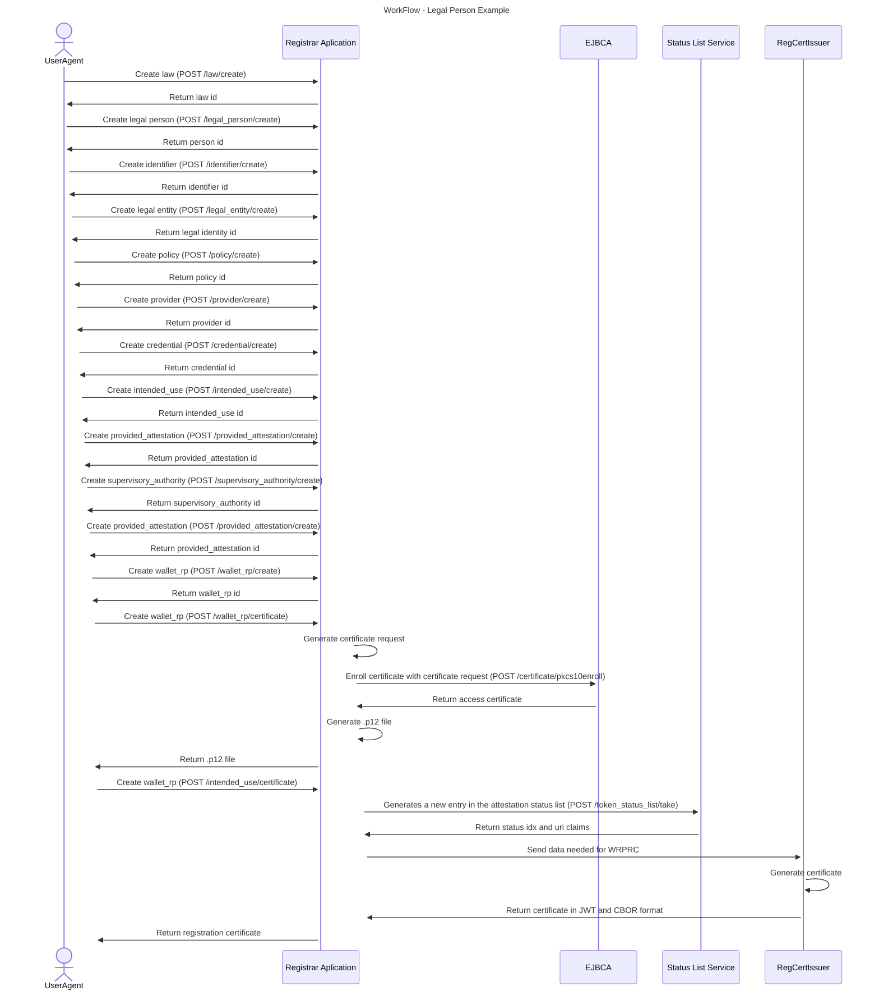

# Relying Party registration service

[](https://www.apache.org/licenses/LICENSE-2.0)

:heavy_exclamation_mark: **Important!** Before you proceed, please read
the [EUDI Wallet Reference Implementation project description](https://github.com/eu-digital-identity-wallet/.github/blob/main/profile/reference-implementation.md)


## Overview

As per the [European Digital Identity Wallet Architecture and Reference Framework Trust Model](https://github.com/eu-digital-identity-wallet/eudi-doc-architecture-and-reference-framework/blob/main/docs/architecture-and-reference-framework-main.md),

+ Relying Parties are registered by a Relying Party Registrar in their Member State.
+ As a result of the registration, a Relying Party receives an access certificate (WRPAC) from a Relying Party Access CA and a registration certificate (WRPRC).

+ The RP access certificate is used by the Wallet Instance to authenticate the Relying Party Instance.
+ The RP registration certificate is used by the Wallet Instance to access the intended use and attribute access policies of a WRP.

+ Relying Party authentication is a process whereby a Relying Party proves its identity to a Wallet Instance, in the context of a transaction in which the Relying Party requests the Wallet Instance to release some attributes.
+ Relying Party authentication is included in the protocol used (both in ISO/IEC 18013-5 and OpenID4VP) by a Wallet Instance and a Relying Party Instance to communicate. 

For more detailed information:

+ [Registrars](https://github.com/eu-digital-identity-wallet/eudi-doc-architecture-and-reference-framework/blob/main/docs/architecture-and-reference-framework-main.md#317-registrars)
+ [Access Certificate Authorities](https://github.com/eu-digital-identity-wallet/eudi-doc-architecture-and-reference-framework/blob/main/docs/architecture-and-reference-framework-main.md#318-access-certificate-authorities)
+ [Providers of registration certificates](https://github.com/eu-digital-identity-wallet/eudi-doc-architecture-and-reference-framework/blob/main/docs/architecture-and-reference-framework-main.md#319-providers-of-registration-certificates)
+ [CIR 2025/848](https://eur-lex.europa.eu/eli/reg_impl/2025/848/oj),
+ [TS5](https://github.com/eu-digital-identity-wallet/eudi-doc-standards-and-technical-specifications/blob/main/docs/technical-specifications/ts5-common-formats-and-api-for-rp-registration-information.md)
+ [TS6](https://github.com/eu-digital-identity-wallet/eudi-doc-standards-and-technical-specifications/blob/main/docs/technical-specifications/ts6-common-set-of-rp-information-to-be-registered.md)

The Relying Party Registration complies with the requirements set out by the [CIR 2025/848](https://eur-lex.europa.eu/eli/reg_impl/2025/848/oj), [TS5](https://github.com/eu-digital-identity-wallet/eudi-doc-standards-and-technical-specifications/blob/main/docs/technical-specifications/ts5-common-formats-and-api-for-rp-registration-information.md) and [TS6](https://github.com/eu-digital-identity-wallet/eudi-doc-standards-and-technical-specifications/blob/main/docs/technical-specifications/ts6-common-set-of-rp-information-to-be-registered.md).

The RP access certificate format complies with [ETSI TS 119 411-8](https://www.etsi.org/deliver/etsi_ts/119400_119499/11941108/01.01.01_60/ts_11941108v010101p.pdf).
The RP registration certificate format complies with [ETSI TS 119 475](https://www.etsi.org/deliver/etsi_ts/119400_119499/119475/01.02.01_60/ts_119475v010201p.pdf).

The Relying Party Registration Service provides two main functionalities:

+ Register a new Relying Party, issuing the Relying Party Instance certificate and keypair in pkcs#12 (P12) format.
+ List the certificates issued and enable their revocation.

For registering a new Relying Party, the relying party is asked to provide the following information:

+ Country in which the relying party is established
+ Name of the relying party as stated in an official record 
+ Common Name of the Relying Party, in a format suitable for presenting to an end-user
+ Registration number as stated in an official record together with identification data of that official record;
+ Contact details (address, e-mail and phone number) of the relying party 
+ Intended use of European Digital Identity Wallets, including an indication of the data to be requested by the relying party from users. (max of 500 chars)
+ Password to secure the private key

After the register information is provided, the Relying Party Access CA issues automatically the Relying Party instance certificate, and the user downloads the Relying Party Instance certificate and keypair in P12 format.


You can use the Relying Party registration service at https://registry.serviceproviders.eudiw.dev/, or install it locally.


## :heavy_exclamation_mark: Disclaimer

The released software is a initial development release version:

-   The initial development release is an early endeavor reflecting the efforts of a short timeboxed
    period, and by no means can be considered as the final product.
-   The initial development release may be changed substantially over time, might introduce new
    features but also may change or remove existing ones, potentially breaking compatibility with your
    existing code.
-   The initial development release is limited in functional scope.
-   The initial development release may contain errors or design flaws and other problems that could
    cause system or other failures and data loss.
-   The initial development release has reduced security, privacy, availability, and reliability
    standards relative to future releases. This could make the software slower, less reliable, or more
    vulnerable to attacks than mature software.
-   The initial development release is not yet comprehensively documented.
-   Users of the software must perform sufficient engineering and additional testing in order to
    properly evaluate their application and determine whether any of the open-sourced components is
    suitable for use in that application.
-   We strongly recommend not putting this version of the software into production use.
-   Only the latest version of the software will be supported


## Installation

Pre-requisites:

  + Python v. 3.9 or 3.10
  + Flask v. 2.3 or higher

Steps: 

To run the EUDIW Issuer, please follow these simple steps (some of which may have already been completed when installing Flask) for Linux/macOS or Windows.


1. Clone the EUDIW Issuer repository:

    ```shell
    git clone git@github.com:eu-digital-identity-wallet/eudi-srv-web-relyingparty-registration-py.git
    ```


2. Enter the project folder

    ```shell
    cd eudi-srv-web-relyingparty-registration-py
    ```

3. Create .venv to install flask and other libraries

    Windows:
    
    ```shell
    python -m venv .venv 
    ```
    
    Linux:

    ```shell
    python3 -m venv .venv
    ```

4. Activate the environment

    windows:
      
    ```shell
    . .venv\Scripts\Activate
    ```
      
    Linux:
    
    ```shell
    . .venv/bin/activate
    ```
    
5. Install the necessary libraries to run the code

    ```shell
    pip install -r app/requirements.txt
    ```

6. Run the Project

    ```shell
    flask --app app run
    ```

## Run

### 1. Database
     
To create the database use the [app/relying_party_reg.sql](app/relying_party_reg.sql) file. It has been tested with MariaDB version 11.5.
  
The file [app/app_config/database.py](app/app_config/database.py) is used to configure the data needed to connect to the database.


### 2. EJBCA
  
The service needs a connection to an EJBCA (<https://www.ejbca.org/>) instance, in order to issue the certificates.
The configuration file for defining access credentials and the location of the admin's PKCS#12 Keystore file and its corresponding password can be found at [app/app_config/EJBCA_config.py](app/app_config/EJBCA_config.py).

+ clientP12ArchiveFilepath - Path for the .p12 needed for the client certificate authentication
+ clientP12ArchivePassword - .p12 password
+ certificateProfilename - Certificate Profile Name already created in EJBCA
+ endEntityProfileName - End Entity Profile name already created in EJBCA
+ username - End Entity username
+ password - End Entity password

### 3. Status List Service

According to ETSI 119 475 - V1.2.1, the WRPRC must be associated with a Status List to provide information about the WRPRC’s validity.

The WRPRC shall ensure that each WRPRC includes a reference to:
• the status list’s unique identifier (e.g., URI); and
• the position index assigned to that WRPRC within the status list.

To this effect, integration with the [eudi-srv-statuslist-py](https://github.com/eu-digital-identity-wallet/eudi-srv-statuslist-py) service was implemented. 

The connection is made via the **url_statuslist** defined in the file [app/app_config/config.py](app/app_config/config.py)
    
### 4. Initial Page

The initial Page of the Relying Party Registration Service (http://127.0.0.1:5000/ or http://localhost:5000/). 

The http://localhost:5000/guide contains an overview of the standard workflow and endpoints of the Registrar Service.

The http://localhost:5000/apidodcs contains the Swagger documentation.

## Run docker

To start Web Relying Party Registration service a docker compose file, [docker-compose.yml](docker/docker-compose.yml), has been implemented that can be found in `docker` directory.

To start the docker compose environment

```
# From project root directory 
cd docker
docker-compose up -d
```

To stop the docker compose environment

```
# From project root directory 
cd docker
docker-compose down
````

## Configuration

The Web Relying Party Registration application can be configured using the following environment variables:

Variable: `SERVICE_URL`<br>
Description: Application service url

Variable: `TRUSTED_CAS_PATH`<br>
Description: Container path where CA certificates are located for validate vp_token when doing PID login

Variable: `VERIFIER`<br>
Description: Verifier URL

Variable: `LOG_PATH`<br>
Description: Path where log files are saved

Variable: `CERT`<br>
Description: Container path where the WRPRC signing certificate is stored

Variable: `PRIV_KEY`<br>
Description: Container path where the private key of the WRPRC signing certificate is stored

Variable: `DB_HOST`<br>
Description: Database URL

Variable: `DB_PORT`<br>
Description: Port where Database is running

Variable: `DB_USER`<br>
Description: Username of Database user

Variable: `DB_PASSWORD`<br>
Description: Password of Database user

Variable: `DB_NAME`<br>
Description: Name of Database

Variable: `EJBCA_URL`<br>
Description: EJBCA URL

Variable: `CLIENTP12_ARCHIVE_FILEPATH`<br>
Description: Client P12 file to acess EJBCA

Variable: `MANAGEMENT_CA`<br>
Description: EJBCA Management CA

Variable: `CLIENTP12_ARCHIVE_PASSWORD`<br>
Description: Cliente P12 password to acess EJBCA

Variable: `EJBCA_USERNAME`<br>
Description: Username of EJBCA user

Variable: `EJBCA_PASSWORD`<br>
Description: Password of EJBCA user

Variable: `CERTIFICATE_PROFILE_NAME`<br>
Description: Name of the profile defined in the EJBCA application

Variable: `END_ENTITY_PROFILE_NAME`<br>
Description: Name of the End Entity Profile defined in the EJBCA application


# Workflow and Endpoints


Step-by-step guide for authentication, entity creation, management and certificate generation.

## Table of Contents

- [Overview](#overview)
- [Authentication](#authentication)
- [Recommended Workflow](#recommended-workflow)
- [Examples](#examples)
- [Certificates](#certificates)
- [Swagger](#swagger)

---

## Overview

The WRP Registry API allows users to authenticate using PID/OID4VP, manage legal entities and wallet relying parties, and generate certificates.

The implementation of the WRP Registrar service and the database it uses complies with the following standards:

+ [CIR 2025/848](https://eur-lex.europa.eu/eli/reg_impl/2025/848/oj),
+ [TS5](https://github.com/eu-digital-identity-wallet/eudi-doc-standards-and-technical-specifications/blob/main/docs/technical-specifications/ts5-common-formats-and-api-for-rp-registration-information.md)
+ [TS6](https://github.com/eu-digital-identity-wallet/eudi-doc-standards-and-technical-specifications/blob/main/docs/technical-specifications/ts6-common-set-of-rp-information-to-be-registered.md)


The RP access certificate format complies with [ETSI TS 119 411-8](https://www.etsi.org/deliver/etsi_ts/119400_119499/11941108/01.01.01_60/ts_11941108v010101p.pdf).

The RP registration certificate format complies with [ETSI TS 119 475](https://www.etsi.org/deliver/etsi_ts/119400_119499/119475/01.02.01_60/ts_119475v010201p.pdf).

## Explanation of how to register a WRP with the Registrar Service

Authentication via the European Digital Identity Wallet (EUDIW), using the PID document, is currently being implemented as part of a trial phase.

Following authentication, the user must register the Natural Person or Legal Person responsible for the Legal Entity associated with the WRP.

Once the Person has been registered, the user can then register at least one Legal Entity. Next, they must register at least one Provider and, finally, at least one WRP.

They must also register at least one intended use and one credential to specify the required information when a Wallet-Relying Party with the role of a Service Provider is requesting data from a Wallet Unit

Once the WRP has been registered, an access certificate can be issued for the WRP and a registration certificate for each intended use.

To summarise the order of the process:

> **Natural Person/Legal Person → Legal Entity → Provider → Wallet Relying Party → Intended Use → Credential**

---
## Authentication flow



## Workflow



### `GET` /authentication

Starts the authentication flow and returns a QR Code together with a presentation ID.

```
GET /authentication
```

### `GET` /pid_authorization

Verifies whether the PID authentication flow has been completed.

### `POST` /getpidoid4vp

Retrieves PID information and returns the user `hash_pid`.

---

## Recommended Workflow

1. Authenticate using the PID/OID4VP flow.
2. Create Law.
3. Create Natural Person/Legal Person.
4. Create Identifiers.
5. Create Natural Person or Legal Person.
6. Create a Legal Entity.
7. Create Policies (wrp).
8. Create a Provider.
9. Create Credential.
10. Create Policies (intended_use).
11. Create Intended Uses.
12. Create Provided Attestations.
13. Create Supervisory Authorities.
14. Create Wallet Relying Parties.
15. Generate certificates.

---

## Examples

### `POST` /law/create
Required dependencies:
+ hash_pid
+ law
  + legislativeIdentifier

```json
{
  "hash_pid": "<hash_pid>",
  "law": [
    {
      "legalBasis": [
        "consent",
        "contract"
      ],
      "legislativeIdentifier": "GDPR-ART-6"
    }
  ]
}
```

### `POST` /legal_person/create

Required dependencies:
  + hash_pid
  + legalPerson
    + legalName

```json
{
  "hash_pid": "<hash_pid>",
  "legalPerson": [
    {
      "law": [<law_ids>],
      "legalName": [
        "Company A",
        "Company B"
      ]
    }
  ]
}
```

### `POST` /identifier/create

Required dependencies:
  + hash_pid
  + identifier
    + identifier
    + type

```json
{
  "hash_pid": "<hash_pid>",
  "identifier": [
    {
      "identifier": "PT123456789",
      "type": "http://data.europa.eu/eudi/id/EORI-No",
    }
  ]
}
```

### `POST` /legal_entity/create

Required dependencies:
  + hash_pid
  + legal_entity
    + identifiers
    + country
    + legal_person_id / natural_person_id

```json
{
  "hash_pid": "<hash_pid>",
  "legal_entity": [
    {
      "country": "PT",
      "email": [
        "test@email.com"
      ],
      "identifiers": [
        <identifiers_ids>
      ],
      "infoURI": [
        "https://example.com"
      ],
      "legal_person_id": <legal_person_id>,
      "phone": [
        "+351912345678"
      ],
      "postalAddress": [
        "Rua A, Porto"
      ]
    }
  ]
}
```

### `POST` /policy/create *(intention: wrp)*

Required dependencies:
  + hash_pid
  + policy
    + intention
    + policyURI
    + type

```json
{
  "hash_pid": "{{hash_pid}}",
  "policy": [
    {
      "intention": "wrp",
      "policyURI": "policy",
      "type": "http://data.europa.eu/eudi/policy/trust-service-practice-statement"
    }
  ]
}
```

### `POST` /provider/create

Required dependencies:
  + hash_pid
  + provider
    + legalEntityId
    + policy_id
    + providerType

```json
{
  "hash_pid": "<hash_pid>",
  "provider": [
    {
      "legalEntityId": <legalEntityId>,
      "policy_id": [
        <policy_id>
      ],
      "providerType": "WALLET_PROVIDER",
      "x5c": [
        "MIIC...base64cert1",
        "MIIC...base64cert2"
      ]
    }
  ]
}
```

### `POST` /credential/create

Required dependencies:
  + hash_pid
  + credentials
    + format
    + meta
      + "values"
    + claims
      + path
    

```json
{
    "hash_pid": "<hash_pid>",
    "credentials": [
        {
            "format": "sd-jwt",
            "meta": {
                "vct_values": [
                    "urn:eudi:pid:1",
                    "urn:eu.europa.ec.eudi:learning:credential:1"
                ]
            },
            "claims": [
                { 
                    "path": [
                        "pid"
                    ]
                }
            ]
        }
    ]
}
```

### `POST` /policy/create *(intention: intended_use)*

Required dependencies:
  + hash_pid
  + policy
    + intention
    + policyURI
    + type

```json
{
  "hash_pid": "{{hash_pid}}",
  "policy": [
    {
      "intention": "intended_use",
      "policyURI": "policy",
      "type": "http://data.europa.eu/eudi/policy/trust-service-practice-statement"
    }
  ]
}
```

### `POST` /intended_use/create

Required dependencies:
  + hash_pid
  + intended_uses
    + purpose
      + content
      + lang
    + privacyPolicy_id
    + intendedUseIdentifier 
    + createdAt
    + revokedAt
    + credential_ids

```json
{
  "hash_pid": "<hash_pid>",
  "intended_uses": [
    {
      "createdAt": "2026-01-01T10:00:00Z",
      "credential_ids": [
        <credential_ids>
      ],
      "intendedUseIdentifier": "USE-001",
      "privacyPolicy_id": [
        <privacyPolicy_ids>
      ],
      "purpose": [
        {
          "content": "Identity verification",
          "lang": "en"
        }
      ],
      "revokedAt": "2027-01-01T10:00:00Z"
    }
  ]
}
```

### `POST` /provided_attestation/create

Required dependencies:
  + hash_pid
  + providesAttestations
    + format
    + meta
      + "values"

```json
{
  "hash_pid": "<hash_pid>",
  "providesAttestations": [
    {
      "format": "dc+sd-jwt",
      "meta": {
        "vct_values": [
          "urn:eudi:pid:1",
          "urn:eu.europa.ec.eudi:learning:credential:1"
        ]
      }
    }
  ]
}
```

### `POST` /supervisory_authority/create

Required dependencies:
  + hash_pid
  + supervisoryAuthority
    + country
    + email / formURI / phone
    + name

```json
{
  "hash_pid": "<hash_pid>",
  "supervisoryAuthority": [
    {
      "country": "PT",
      "email": [
        "geral@cnpd.pt"
      ],
      "formURI": [
        "https://www.cnpd.pt/contactos"
      ],
      "name": "CNPD",
      "phone": [
        "+351213928400"
      ]
    }
  ]
}
```

### `POST` /wallet_rp/create

Required dependencies:
  + hash_pid
  + WalletRelyingParty
    + supportURI
    + srvDescription
      + content
      + lang
    + intendedUse_ids
    + entitlements
    + supervisoryAuthority
    + registryURI

```json
{
  "WalletRelyingParty": [
    {
      "entitlements": [
        "https://uri.etsi.org/19475/Entitlement/Service_Provider"
      ],
      "intendedUse_ids": [
        <intendedUse_ids>
      ],
      "isPSB": true,
      "provider_id": <provider_id>,
      "providesAttestations_id": [
        <providesAttestations_ids>
      ],
      "registryURI": "https://registry.example.com",
      "srvDescription": [
        {
          "content": "Wallet authentication service",
          "lang": "en"
        }
      ],
      "supervisoryAuthority": supervisoryAuthority_id,
      "supportURI": [
        "https://support.example.com"
      ],
      "tradeName": "My Wallet Service"
    }
  ],
  "hash_pid": "<hash_pid>"
}
```

---

## Certificates

### `POST` /intended_use/certificate

```json
{
  "hash_pid": "<hash_pid>",
  "intended_use_id": <intended_use_id>
}
```

Generates a signed Intended Use Registration Certificate using JAdES and COSE.

### `POST` /wallet_rp/certificate

```json
{
  "hash_pid": "<hash_pid>",
  "password": "StrongPassword123!",
  "wrp_id": <wrp_id>
}
```

Generates a Wallet Relying Party certificate in PKCS#12 format.

---

## Swagger

Full API documentation is available through Swagger UI.

```
/apidocs/
```

---

*WRP Registry API Guide*
The API uses an authentication flow based on OID4VP and PID verification.

The authentication process works as follows:

1. Start the authentication flow and obtain a QR Code and `presentation_id`
2. Wait for PID authorization validation
3. Retrieve the authenticated user's `hash_pid`
4. Use the `hash_pid` in authenticated endpoints

---

## Authentication Endpoints

| Method | Endpoint | Description |
|---|---|---|
| GET | `/authentication` | Start authentication flow and generate QR Code |
| GET | `/pid_authorization` | Validate PID authorization status |
| GET / POST | `/getpidoid4vp` | Retrieve PID data and obtain `hash_pid` |

---

## Authentication Flow Description

### 1. `/authentication`

Starts the authentication process.

Returns:
- QR Code for wallet authentication
- `presentation_id`

The QR Code must be scanned by the user's wallet application.

---

### 2. `/pid_authorization`

Checks whether the PID authorization was completed successfully.
This endpoint waits for the authentication result and validates the received PID authorization.

---

### 3. `/getpidoid4vp`

Retrieves the PID data obtained through the OID4VP flow.

Returns:
- User PID information
- Generated `hash_pid`

The returned `hash_pid` must be used in authenticated API requests.

---

## Example Authenticated Request

```json
{
  "hash_pid": "<hash_pid>"
}
```

# Endpoints
---

## Identifier Endpoints

| Method | Endpoint | Description |
|---|---|---|
| POST | `/identifier/create` | Create identifiers |
| POST | `/identifier/list` | Retrieve identifiers |

---

## Law Endpoints

| Method | Endpoint | Description |
|---|---|---|
| POST | `/law/create` | Create laws |
| POST | `/law/list` | Retrieve laws |

---

## Natural Person Endpoints

| Method | Endpoint | Description |
|---|---|---|
| POST | `/natural_person/create` | Create natural persons |
| POST | `/natural_person/list` | Retrieve natural persons |

---

## Legal Person Endpoints

| Method | Endpoint | Description |
|---|---|---|
| POST | `/legal_person/create` | Create legal persons |
| POST | `/legal_person/list` | Retrieve legal persons |
| POST | `/legal_person/update_law` | Associate laws with legal persons |
| POST | `/legal_person/remove_law` | Remove laws from legal persons |

---

## Legal Entity Endpoints

| Method | Endpoint | Description |
|---|---|---|
| POST | `/legal_entity/create` | Create legal entities |
| POST | `/legal_entity/list` | Retrieve legal entities |
| POST | `/legal_entity/update_identifier` | Associate identifiers |
| POST | `/legal_entity/remove_identifier` | Remove identifiers |

---

## Policy Endpoints

| Method | Endpoint | Description |
|---|---|---|
| POST | `/policy/create` | Create policies |
| POST | `/policy/list` | Retrieve policies |

---

## Provider Endpoints

| Method | Endpoint | Description |
|---|---|---|
| POST | `/provider/create` | Create providers |
| POST | `/provider/list` | Retrieve providers |
| POST | `/provider/update_policy` | Associate policies with providers |
| POST | `/provider/remove_policy` | Remove policies from providers |

---

## Credential Endpoints

| Method | Endpoint | Description |
|---|---|---|
| POST | `/credential/create` | Create credentials |
| POST | `/credential/list` | Retrieve credentials |
| POST | `/list_claim` | Retrieve claims |

---

## Intended Use Endpoints

| Method | Endpoint | Description |
|---|---|---|
| POST | `/intended_use/create` | Create intended uses |
| POST | `/intended_use/list` | Retrieve intended uses |
| POST | `/intended_use/update_credential` | Associate credentials |
| POST | `/intended_use/update_policy` | Associate policies |
| POST | `/intended_use/remove_credential` | Remove credentials |
| POST | `/intended_use/remove_policy` | Remove policies |

---

## Provided Attestation Endpoints

| Method | Endpoint | Description |
|---|---|---|
| POST | `/provided_attestation/create` | Create provided attestations |
| POST | `/provided_attestation/list` | Retrieve provided attestations |

---

## Supervisory Authority Endpoints

| Method | Endpoint | Description |
|---|---|---|
| POST | `/supervisory_authority/create` | Create supervisory authorities |
| POST | `/supervisory_authority/list` | Retrieve supervisory authorities |

---

## Wallet Relying Party Endpoints

| Method | Endpoint | Description |
|---|---|---|
| POST | `/wallet_rp/create` | Create Wallet Relying Parties |
| POST | `/wallet_rp/list` | Retrieve Wallet Relying Parties |
| POST | `/wallet_rp/update_intended_use` | Associate intended uses |
| POST | `/wallet_rp/update_provided_attestation` | Associate provided attestations |
| POST | `/wallet_rp/update_uses_intermediary` | Associate intermediary WRPs |
| POST | `/wallet_rp/remove_intended_use` | Remove intended uses |
| POST | `/wallet_rp/remove_provided_attestation` | Remove provided attestations |
| POST | `/wallet_rp/remove_uses_intermediary` | Remove intermediary WRPs |

---

## Public Endpoints

| Method | Endpoint | Description |
|---|---|---|
| GET | `/wrp` | Search Wallet Relying Parties |
| GET | `/wrp/<identifier>` | Retrieve Wallet Relying Party by identifier |
| GET | `/wrp/check-intended-use` | Validate intended use compatibility |

---

## Utility Endpoints

| Method | Endpoint | Description |
|---|---|---|
| POST | `/list_full_info` | Retrieve complete hierarchical user information |

## Certificates

| Method | Endpoint | Description |
|---|---|---|
| POST | `/intended_use/certificate` | Generate Intended Use Registration Certificate |
| POST | `/wallet_rp/certificate` | Generate Wallet Relying Party Access Certificate |

---
## API Documentation

All available endpoints, request parameters, request body schemas, response formats, and example requests can be consulted through the Swagger API documentation.

The Swagger interface provides an interactive environment where users can explore and test every available endpoint.

| Environment | URL                                                    |
| ----------- | ------------------------------------------------------ |
| Local       | `http://localhost:5000/apidocs/`                       |
| Online      | `https://registry.serviceproviders.eudiw.dev/apidocs/` |

The Swagger documentation should be considered the primary reference for the API specification, as it is kept up to date with the latest endpoint definitions and supported request/response formats.

--- 
## End-to-End Example
The following example demonstrates a complete registration workflow using the REST API.

The commands below illustrate the typical sequence of requests required to:

* authenticate the user and obtain a hash_pid.
* register all required resources.
* generate a Registration Certificate.
* generate an Access Certificate.

The example uses curl commands and sample values that comply with the referenced technical specifications. Replace identifiers returned by each step (e.g. law_id, provider_id, wrp_id) with the values obtained from your own deployment.

| Step | Endpoint                 | Purpose                           |
| ---- | ------------------------ | --------------------------------- |
| 1    | Authentication           | Obtain `hash_pid`                 |
| 2    | Law                      | Register legal basis              |
| 3    | Legal Person             | Create legal person               |
| 4    | Identifier               | Create organization identifier    |
| 5    | Legal Entity             | Create legal entity               |
| 6    | Policy                   | Create policy                     |
| 7    | Provider                 | Create provider                   |
| 8    | Credential               | Create credential                 |
| 9    | Intended Use             | Create intended use               |
| 10   | Provided Attestation     | Register attestation              |
| 11   | Supervisory Authority    | Register supervisory authority    |
| 12   | Wallet RP                | Create Wallet RP                  |
| 13   | Registration Certificate | Generate registration certificate |
| 14   | Access Certificate       | Generate access certificate       |

### Step 1 - Create Law
#### POST /law/create

``` code
curl --location 'https://registry.serviceproviders.eudiw.dev/law/create' \
--header 'Content-Type: application/json' \
--data '{
    "hash_pid": "<hash_pid>",
    "law": [
        {
            "legislativeIdentifier": "LAW123",
            "legalBasis": ["basis1", "basis2"]
        }
    ]
}'
```

### Step 2 - Create Legal Person
#### POST /legal_person/create

```code
curl --location 'https://registry.serviceproviders.eudiw.dev/legal_person/create' \
--header 'Content-Type: application/json' \
--data '{
    "hash_pid": "<hash_pid>",
    "legalPerson": [
        {
          "law": [
            <law_id>
          ],
          "legalName": [
            "Company A",
            "Company B"
          ]
        }
    ]
}'
```

### Step 3 - Create Identifier
#### POST /identifier/create

``` code
curl --location 'https://registry.serviceproviders.eudiw.dev/identifier/create' \
--header 'Content-Type: application/json' \
--data '{
    "hash_pid": "<hash_pid>",
    "identifier": [
        {
            "identifier": "PT123456789",
            "type": "http://data.europa.eu/eudi/id/EORI-No"
        }
    ]
}'
```

### Step 4 - Create Legal Entity
#### POST /legal_entity/create

``` code
curl --location 'https://registry.serviceproviders.eudiw.dev/legal_entity/create' \
--data-raw '{
    "hash_pid": "<hash_pid>",

    "legal_entity": [
        {
            "postalAddress": [
                "Rua A, Porto",
                "Av B, Lisboa"
            ],

            "country": "FR",

            "email": [
                "contact@empresa.pt",
                "support@empresa.pt"
            ],

            "phone": [
                "+351912345678",
                "+351212345678"
            ],

            "infoURI": [
                "https://empresa.pt/info",
                "https://empresa.pt/about"
            ],

            "identifiers": [<identifiers_ids>],

            "legal_person_id": <legal_person_id>
        }
    ]
}'
```

### Step 5 - Create Policy
#### POST /policy/create (Wallet RP)

``` code
curl --location 'https://registry.serviceproviders.eudiw.dev/policy/create' \
--header 'Content-Type: application/json' \
--data '{
    "hash_pid": "<hash_pid>",
    "policy": [
        {  
            "intention": "wrp",
            "policyURI": "policy",
            "type": "http://data.europa.eu/eudi/policy/trust-service-practice-statement"
        }
    ]
}'
```

### Step 6 - Create Provider
#### POST /provider/create

``` code
curl --location 'https://registry.serviceproviders.eudiw.dev/provider/create' \
--header 'Content-Type: application/json' \
--data '{
    "hash_pid": "<hash_pid>",

    "provider": [
        {
            "legalEntityId": <legal_Entity_Id>,

            "providerType": "EAA_PROVIDER",

            "x5c": [
                "cert1_base64",
                "cert2_base64"
            ],

            "policy_id": [<policy_id>]
        }
    ]
}'
```

### Step 7 - Create Credential
#### POST /credential/create

``` code
curl --location 'https://registry.serviceproviders.eudiw.dev/credential/create' \
--header 'Content-Type: application/json' \
--data '{
    "hash_pid": "<hash_pid>",
    "credentials": [
        {
            "format": "sd-jwt",
            "meta": {
                "vct_values": [
                    "urn:eudi:pid:1",
                    "urn:eu.europa.ec.eudi:learning:credential:1"
                ]
            },
            "claims": [
                { 
                    "path": [
                        "pid",
                        "address",
                        0,
                        "street"
                    ]
                }
            ]
        }
    ]
}'
```

### Step 8 - Create Policy (Intended Use)
#### POST /policy/create 

``` code
curl --location 'https://registry.serviceproviders.eudiw.dev/policy/create' \
--header 'Content-Type: application/json' \
--data '{
    "hash_pid": "<hash_pid>",
    "policy": [
        {
            "intention": "intended_use",
            "policyURI": "https://empresa.pt/terms",
            "type": "http://data.europa.eu/eudi/policy/trust-service-practice-statement"
        }
    ]
}'
```

### Step 9 - Create Intended Use
#### POST /intended_use/create

``` code
curl --location 'https://registry.serviceproviders.eudiw.dev/intended_use/create' \
--header 'Content-Type: application/json' \
--data '{
    "hash_pid": "<hash_pid>",
    "intended_uses": [
        {
            "intendedUseIdentifier": "iu_1",
            "createdAt": "2026-04-17",
            "revokedAt": "2026-04-17",

            "purpose": [
                {
                    "lang": "en",
                    "content": "Access banking services"
                },
                {
                    "lang": "pt",
                    "content": "Aceder a serviços bancários"
                }
            ],

            "privacyPolicy_id": [<privacyPolicy_id>],
            "credential_ids": [<credential_ids>]
        }
    ]
}'
```

### Step 10 - Provided Attestation
#### POST /provided_attestation/create

``` code
curl --location 'https://registry.serviceproviders.eudiw.dev/provided_attestation/create' \
--header 'Content-Type: application/json' \
--data '{
    "hash_pid": "<hash_pid>",
    "providesAttestations": [
        {
        "format": "dc+sd-jwt",
        "meta": {
            "vct_values": [
            "urn:eudi:pid:1",
            "urn:eu.europa.ec.eudi:learning:credential:1"
            ]
        }
        }
    ]
}'
```

### Step 11 - Create Supervisory Authority
#### POST /supervisory_authority/create

``` code
curl --location 'https://registry.serviceproviders.eudiw.dev/supervisory_authority/create' \
--header 'Content-Type: application/json' \
--data-raw '{
    "hash_pid": "<hash_pid>",

    "supervisoryAuthority": [
        {
            "name": "ACME Authority",
            "country": "PT",
            "email": [
                "authority@acme.com"
            ],
            "phone": [
                "+351912345678"
            ],
            "formURI": [
                "https://acme.com/form"
            ]
        }
    ]
}'
```

### Step 12 - Create Wallet Relying Party
#### POST /wallet_rp/create

``` code
curl --location 'https://registry.serviceproviders.eudiw.dev/wallet_rp/create' \
--header 'Content-Type: application/json' \
--data '{
    "hash_pid": "<hash_pid>",

    "WalletRelyingParty": [
        {
            "tradeName": "PY Issuer Dev",

            "supportURI": [
                "https://acme.com/support",
                "https://help.acme.com"
            ],

            "srvDescription": [
                {
                    "lang": "en",
                    "content": "Provides authentication services for ACME users."
                },
                {
                    "lang": "pt",
                    "content": "Fornece serviços de autenticação para utilizadores ACME."
                }
            ],

            "isPSB": false,

            "entitlements": [
                "asadsasd"
            ],

            "usesIntermediary": [],

            "providesAttestations_id": [<provides_Attestations_id>],

            "registryURI": "https://registry.acme.com",

            "supervisoryAuthority": <supervisory_Authority>,

            "provider_id": <provider_id>,

            "intendedUse_ids": [<intended_Use_ids>]
        }
    ]
}'
```

### Step 13 - Generate Registration Certificate
#### POST /intended_use/certificate

``` code
curl --location 'https://registry.serviceproviders.eudiw.dev/wallet_rp/certificate' \
--header 'Content-Type: application/json' \
--data '{
    "hash_pid": "<hash_pid>",
    "wrp_id": 1,
    "password": "<password>"
}'
```

### Step 14 - Generate Access Certificate
#### POST /wallet_rp/certificate

``` code
curl --location 'https://registry.serviceproviders.eudiw.dev/intended_use/certificate' \
--data '{
    "hash_pid": "<hash_pid>",
    "intended_use_id": <intended_use_id>
}'
``` 

## Swagger Documentation

The complete API documentation, including all available endpoints, request parameters, request/response examples, and schemas, is available through Swagger UI.

### Local instance

When running the project locally, the Swagger documentation is available at:

```
http://localhost:5000/apidocs
```

*(Adjust the host and port if your local deployment uses different values.)*

### Online instance

The latest online Swagger documentation is available at:

```
https://registry.serviceproviders.eudiw.dev/apidocs
```

## How to contribute

We welcome contributions to this project. To ensure that the process is smooth for everyone
involved, follow the guidelines found in [CONTRIBUTING.md](CONTRIBUTING.md).

## License

### License details

Copyright (c) 2024 European Commission

Licensed under the Apache License, Version 2.0 (the "License");
you may not use this file except in compliance with the License.
You may obtain a copy of the License at

    http://www.apache.org/licenses/LICENSE-2.0

Unless required by applicable law or agreed to in writing, software
distributed under the License is distributed on an "AS IS" BASIS,
WITHOUT WARRANTIES OR CONDITIONS OF ANY KIND, either express or implied.
See the License for the specific language governing permissions and
limitations under the License.
