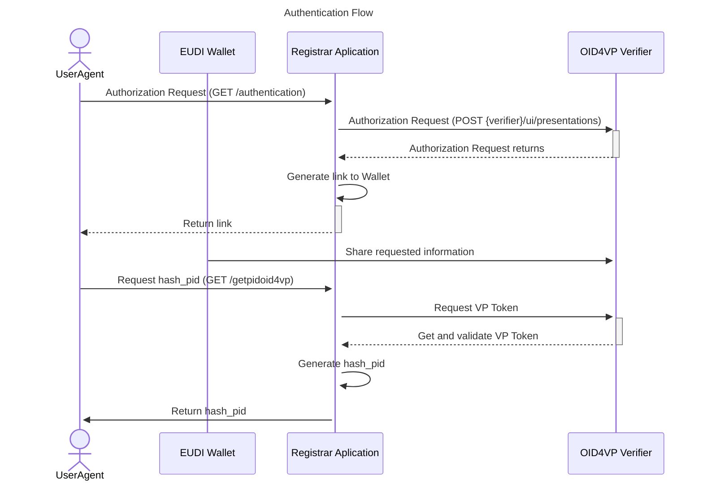

# Workflow and Endpoints


Step-by-step guide for authentication, entity creation, management and certificate generation.

## Table of Contents

- [Overview](#overview)
- [Authentication](#authentication)
- [Recommended Workflow](#recommended-workflow)
- [Examples](#examples)
- [Certificates](#certificates)
- [Swagger](#swagger)

---

## Overview

The WRP Registry API allows users to authenticate using PID/OID4VP, manage legal entities and wallet relying parties, and generate certificates.

The implementation of the WRP Registrar service and the database it uses complies with the following standards:

+ [CIR 2025/848](https://eur-lex.europa.eu/eli/reg_impl/2025/848/oj),
+ [TS5](https://github.com/eu-digital-identity-wallet/eudi-doc-standards-and-technical-specifications/blob/main/docs/technical-specifications/ts5-common-formats-and-api-for-rp-registration-information.md)
+ [TS6](https://github.com/eu-digital-identity-wallet/eudi-doc-standards-and-technical-specifications/blob/main/docs/technical-specifications/ts6-common-set-of-rp-information-to-be-registered.md)


The RP access certificate format complies with [ETSI TS 119 411-8](https://www.etsi.org/deliver/etsi_ts/119400_119499/11941108/01.01.01_60/ts_11941108v010101p.pdf).

The RP registration certificate format complies with [ETSI TS 119 475](https://www.etsi.org/deliver/etsi_ts/119400_119499/119475/01.02.01_60/ts_119475v010201p.pdf).

## Explanation of how to register a WRP with the Registrar Service

Authentication via the European Digital Identity Wallet (EUDIW), using the PID document, is currently being implemented as part of a trial phase.

Following authentication, the user must register the Natural Person or Legal Person responsible for the Legal Entity associated with the WRP.

Once the Person has been registered, the user can then register at least one Legal Entity. Next, they must register at least one Provider and, finally, at least one WRP.

They must also register at least one intended use and one credential to specify the required information when a Wallet-Relying Party with the role of a Service Provider is requesting data from a Wallet Unit

Once the WRP has been registered, an access certificate can be issued for the WRP and a registration certificate for each intended use.

To summarise the order of the process:

> **Natural Person/Legal Person → Legal Entity → Provider → Wallet Relying Party → Intended Use → Credential**

---
## Authentication flow



## Workflow

### `GET` /authentication

Starts the authentication flow and returns a QR Code together with a presentation ID.

```
GET /authentication
```

### `GET` /pid_authorization

Verifies whether the PID authentication flow has been completed.

### `POST` /getpidoid4vp

Retrieves PID information and returns the user `hash_pid`.

---

## Recommended Workflow

1. Authenticate using the PID/OID4VP flow.
2. Create Law.
3. Create Natural Person/Legal Person.
4. Create Identifiers.
5. Create Natural Person or Legal Person.
6. Create a Legal Entity.
7. Create Policies (wrp).
8. Create a Provider.
9. Create Credential.
10. Create Policies (intended_use).
11. Create Intended Uses.
12. Create Provided Attestations.
13. Create Supervisory Authorities.
14. Create Wallet Relying Parties.
15. Generate certificates.

---

## Examples

### `POST` /law/create

+ hash_pid
+ law

```json
{
  "hash_pid": "abc123hash",
  "law": [
    {
      "legalBasis": [
        "consent",
        "contract"
      ],
      "legislativeIdentifier": "GDPR-ART-6"
    }
  ]
}
```

### `POST` /legal_person/create

```json
{
  "hash_pid": "abc123hash",
  "legalPerson": [
    {
      "law": [1],
      "legalName": [
        "Company A",
        "Company B"
      ]
    }
  ]
}
```

### `POST` /identifier/create

```json
{
  "hash_pid": "abc123hash",
  "identifier": [
    {
      "identifier": "PT123456789",
      "type": "http://data.europa.eu/eudi/id/EORI-No"
    }
  ]
}
```

### `POST` /legal_entity/create

```json
{
  "hash_pid": "abc123hash",
  "legal_entity": [
    {
      "country": "PT",
      "email": [
        "test@email.com"
      ],
      "identifiers": [
        1
      ],
      "infoURI": [
        "https://example.com"
      ],
      "legal_person_id": 1,
      "phone": [
        "+351912345678"
      ],
      "postalAddress": [
        "Rua A, Porto"
      ]
    }
  ]
}
```

### `POST` /policy/create *(intention: wrp)*

```json
{
  "hash_pid": "{{hash_pid}}",
  "policy": [
    {
      "intention": "wrp",
      "policyURI": "policy",
      "type": "http://data.europa.eu/eudi/policy/trust-service-practice-statement"
    }
  ]
}
```

### `POST` /provider/create

```json
{
  "hash_pid": "abc123hash",
  "provider": [
    {
      "legalEntityId": 1,
      "policy_id": [
        1
      ],
      "providerType": "WALLET_PROVIDER",
      "x5c": [
        "MIIC...base64cert1",
        "MIIC...base64cert2"
      ]
    }
  ]
}
```

### `POST` /credential/create

```json
{
  "credentials": [
    {
      "claims": [
        {
          "path": "credentialSubject.name"
        }
      ],
      "format": "jwt_vc",
      "meta": "PID Credential"
    }
  ],
  "hash_pid": "abc123hash"
}
```

### `POST` /policy/create *(intention: intended_use)*

```json
{
  "hash_pid": "{{hash_pid}}",
  "policy": [
    {
      "intention": "intended_use",
      "policyURI": "policy",
      "type": "http://data.europa.eu/eudi/policy/trust-service-practice-statement"
    }
  ]
}
```

### `POST` /intended_use/create

```json
{
  "hash_pid": "abc123hash",
  "intended_uses": [
    {
      "createdAt": "2026-01-01T10:00:00Z",
      "credential_ids": [
        1
      ],
      "intendedUseIdentifier": "USE-001",
      "privacyPolicy_id": [
        2
      ],
      "purpose": [
        {
          "content": "Identity verification",
          "lang": "en"
        }
      ],
      "revokedAt": "2027-01-01T10:00:00Z"
    }
  ]
}
```

### `POST` /provided_attestation/create

```json
{
  "hash_pid": "abc123hash",
  "providesAttestations": [
    {
      "format": "jwt",
      "meta": "issuer metadata info"
    }
  ]
}
```

### `POST` /supervisory_authority/create

```json
{
  "hash_pid": "abc123hash",
  "supervisoryAuthority": [
    {
      "country": "PT",
      "email": [
        "geral@cnpd.pt"
      ],
      "formURI": [
        "https://www.cnpd.pt/contactos"
      ],
      "name": "CNPD",
      "phone": [
        "+351213928400"
      ]
    }
  ]
}
```

### `POST` /wallet_rp/create

```json
{
  "WalletRelyingParty": [
    {
      "entitlements": [
        "AGE_VERIFICATION"
      ],
      "intendedUse_ids": [
        1
      ],
      "isPSB": true,
      "provider_id": 1,
      "providesAttestations_id": [
        1
      ],
      "registryURI": "https://registry.example.com",
      "srvDescription": [
        {
          "content": "Wallet authentication service",
          "lang": "en"
        }
      ],
      "supervisoryAuthority": 1,
      "supportURI": [
        "https://support.example.com"
      ],
      "tradeName": "My Wallet Service"
    }
  ],
  "hash_pid": "abc123hash"
}
```

---

## Certificates

### `POST` /intended_use/certificate

```json
{
  "hash_pid": "abc123hash",
  "intended_use_id": 1
}
```

Generates a signed Intended Use Registration Certificate using JAdES and COSE.

### `POST` /wallet_rp/certificate

```json
{
  "hash_pid": "abc123hash",
  "password": "StrongPassword123!",
  "wrp_id": 1
}
```

Generates a Wallet Relying Party certificate in PKCS#12 format.

---

## Swagger

Full API documentation is available through Swagger UI.

```
/apidocs/
```

---

*WRP Registry API Guide*
The API uses an authentication flow based on OID4VP and PID verification.

The authentication process works as follows:

1. Start the authentication flow and obtain a QR Code and `presentation_id`
2. Wait for PID authorization validation
3. Retrieve the authenticated user's `hash_pid`
4. Use the `hash_pid` in authenticated endpoints

---

## Authentication Endpoints

| Method | Endpoint | Description |
|---|---|---|
| GET | `/authentication` | Start authentication flow and generate QR Code |
| GET | `/pid_authorization` | Validate PID authorization status |
| GET / POST | `/getpidoid4vp` | Retrieve PID data and obtain `hash_pid` |

---

## Authentication Flow Description

### 1. `/authentication`

Starts the authentication process.

Returns:
- QR Code for wallet authentication
- `presentation_id`

The QR Code must be scanned by the user's wallet application.

---

### 2. `/pid_authorization`

Checks whether the PID authorization was completed successfully.
This endpoint waits for the authentication result and validates the received PID authorization.

---

### 3. `/getpidoid4vp`

Retrieves the PID data obtained through the OID4VP flow.

Returns:
- User PID information
- Generated `hash_pid`

The returned `hash_pid` must be used in authenticated API requests.

---

## Example Authenticated Request

```json
{
  "hash_pid": "abc123hash"
}
```

# Endpoints
---

## Identifier Endpoints

| Method | Endpoint | Description |
|---|---|---|
| POST | `/identifier/create` | Create identifiers |
| POST | `/identifier/list` | Retrieve identifiers |

---

## Law Endpoints

| Method | Endpoint | Description |
|---|---|---|
| POST | `/law/create` | Create laws |
| POST | `/law/list` | Retrieve laws |

---

## Natural Person Endpoints

| Method | Endpoint | Description |
|---|---|---|
| POST | `/natural_person/create` | Create natural persons |
| POST | `/natural_person/list` | Retrieve natural persons |

---

## Legal Person Endpoints

| Method | Endpoint | Description |
|---|---|---|
| POST | `/legal_person/create` | Create legal persons |
| POST | `/legal_person/list` | Retrieve legal persons |
| POST | `/legal_person/update_law` | Associate laws with legal persons |
| POST | `/legal_person/remove_law` | Remove laws from legal persons |

---

## Legal Entity Endpoints

| Method | Endpoint | Description |
|---|---|---|
| POST | `/legal_entity/create` | Create legal entities |
| POST | `/legal_entity/list` | Retrieve legal entities |
| POST | `/legal_entity/update_identifier` | Associate identifiers |
| POST | `/legal_entity/remove_identifier` | Remove identifiers |

---

## Policy Endpoints

| Method | Endpoint | Description |
|---|---|---|
| POST | `/policy/create` | Create policies |
| POST | `/policy/list` | Retrieve policies |

---

## Provider Endpoints

| Method | Endpoint | Description |
|---|---|---|
| POST | `/provider/create` | Create providers |
| POST | `/provider/list` | Retrieve providers |
| POST | `/provider/update_policy` | Associate policies with providers |
| POST | `/provider/remove_policy` | Remove policies from providers |

---

## Credential Endpoints

| Method | Endpoint | Description |
|---|---|---|
| POST | `/credential/create` | Create credentials |
| POST | `/credential/list` | Retrieve credentials |
| POST | `/list_claim` | Retrieve claims |

---

## Intended Use Endpoints

| Method | Endpoint | Description |
|---|---|---|
| POST | `/intended_use/create` | Create intended uses |
| POST | `/intended_use/list` | Retrieve intended uses |
| POST | `/intended_use/update_credential` | Associate credentials |
| POST | `/intended_use/update_policy` | Associate policies |
| POST | `/intended_use/remove_credential` | Remove credentials |
| POST | `/intended_use/remove_policy` | Remove policies |

---

## Provided Attestation Endpoints

| Method | Endpoint | Description |
|---|---|---|
| POST | `/provided_attestation/create` | Create provided attestations |
| POST | `/provided_attestation/list` | Retrieve provided attestations |

---

## Supervisory Authority Endpoints

| Method | Endpoint | Description |
|---|---|---|
| POST | `/supervisory_authority/create` | Create supervisory authorities |
| POST | `/supervisory_authority/list` | Retrieve supervisory authorities |

---

## Wallet Relying Party Endpoints

| Method | Endpoint | Description |
|---|---|---|
| POST | `/wallet_rp/create` | Create Wallet Relying Parties |
| POST | `/wallet_rp/list` | Retrieve Wallet Relying Parties |
| POST | `/wallet_rp/update_intended_use` | Associate intended uses |
| POST | `/wallet_rp/update_provided_attestation` | Associate provided attestations |
| POST | `/wallet_rp/update_uses_intermediary` | Associate intermediary WRPs |
| POST | `/wallet_rp/remove_intended_use` | Remove intended uses |
| POST | `/wallet_rp/remove_provided_attestation` | Remove provided attestations |
| POST | `/wallet_rp/remove_uses_intermediary` | Remove intermediary WRPs |

---

## Public Endpoints

| Method | Endpoint | Description |
|---|---|---|
| GET | `/wrp` | Search Wallet Relying Parties |
| GET | `/wrp/<identifier>` | Retrieve Wallet Relying Party by identifier |
| GET | `/wrp/check-intended-use` | Validate intended use compatibility |

---

## Utility Endpoints

| Method | Endpoint | Description |
|---|---|---|
| POST | `/list_full_info` | Retrieve complete hierarchical user information |

## Certificates

| Method | Endpoint | Description |
|---|---|---|
| POST | `/intended_use/certificate` | Generate Intended Use Registration Certificate |
| POST | `/wallet_rp/certificate` | Generate Wallet Relying Party Access Certificate |
