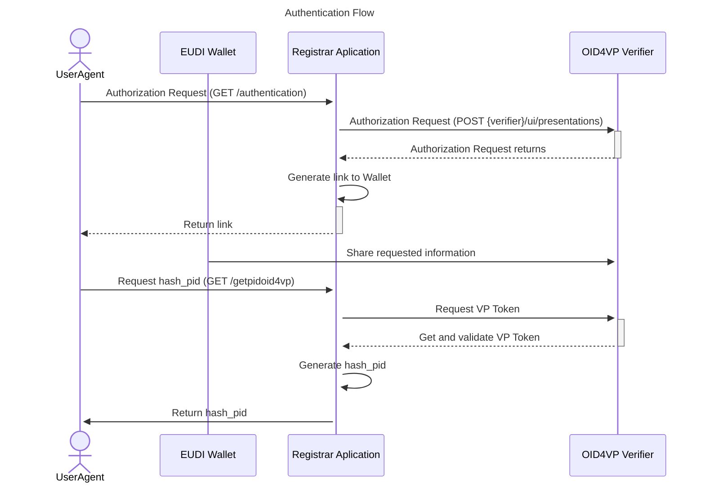
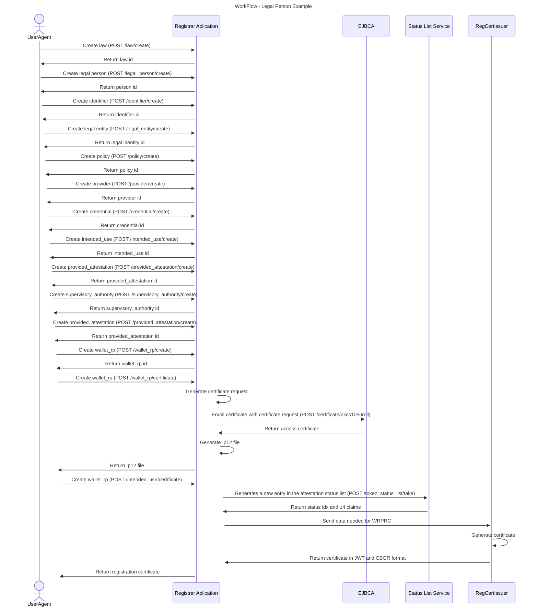

# Workflow and Endpoints


Step-by-step guide for authentication, entity creation, management and certificate generation.

## Table of Contents

- [Overview](#overview)
- [Authentication Flow](#authentication-flow)
- [Recommended Workflow](#recommended-workflow)
- [End-to-End Example](#end-to-end-example)
- [Swagger](#swagger)

---

## Overview

The WRP Registry API allows users to authenticate using PID/OID4VP, manage legal entities and wallet relying parties, and generate certificates.

The implementation of the WRP Registrar service and the database it uses complies with the following standards:

+ [CIR 2025/848](https://eur-lex.europa.eu/eli/reg_impl/2025/848/oj),
+ [TS5](https://github.com/eu-digital-identity-wallet/eudi-doc-standards-and-technical-specifications/blob/main/docs/technical-specifications/ts5-common-formats-and-api-for-rp-registration-information.md)
+ [TS6](https://github.com/eu-digital-identity-wallet/eudi-doc-standards-and-technical-specifications/blob/main/docs/technical-specifications/ts6-common-set-of-rp-information-to-be-registered.md)


The RP access certificate format complies with [ETSI TS 119 411-8](https://www.etsi.org/deliver/etsi_ts/119400_119499/11941108/01.01.01_60/ts_11941108v010101p.pdf).

The RP registration certificate format complies with [ETSI TS 119 475](https://www.etsi.org/deliver/etsi_ts/119400_119499/119475/01.02.01_60/ts_119475v010201p.pdf).

## Explanation of how to register a WRP with the Registrar Service

Authentication via the European Digital Identity Wallet (EUDIW), using the PID document, is currently being implemented as part of a trial phase.

Following authentication, the user must register the Natural Person or Legal Person responsible for the Legal Entity associated with the WRP.

Once the Person has been registered, the user can then register at least one Legal Entity. Next, they must register at least one Provider and, finally, at least one WRP.

They must also register at least one intended use and one credential to specify the required information when a Wallet-Relying Party with the role of a Service Provider is requesting data from a Wallet Unit

Once the WRP has been registered, an access certificate can be issued for the WRP and a registration certificate for each intended use.

To summarise the order of the process:

> **Law (in Legal Person use case) → Natural Person/Legal Person → Legal Entity → Provider → Wallet Relying Party → Intended Use → Credential**

---
## Authentication Flow



### Recommended Workflow



## End-to-End Example
The following example demonstrates a complete registration workflow using the REST API.

All endpoints and their respective parameters can be found in [Swagger](#swagger) section.

The commands below illustrate the typical sequence of requests required to:

* authenticate the user and obtain a hash_pid.
* register all required resources.
* generate a Registration Certificate.
* generate an Access Certificate.

The example uses curl commands and sample values that comply with the referenced technical specifications. Replace identifiers returned by each step (e.g. law_id, provider_id, wrp_id) with the values obtained from your own deployment.

| Step | Endpoint                 | Purpose                           |
| ---- | ------------------------ | --------------------------------- |
| 1    | Authentication           | Obtain `hash_pid`                 |
| 2    | Law                      | Register legal basis              |
| 3    | Legal Person             | Create legal person               |
| 4    | Identifier               | Create organization identifier    |
| 5    | Legal Entity             | Create legal entity               |
| 6    | Policy                   | Create policy                     |
| 7    | Provider                 | Create provider                   |
| 8    | Credential               | Create credential                 |
| 9    | Intended Use             | Create intended use               |
| 10   | Provided Attestation     | Register attestation              |
| 11   | Supervisory Authority    | Register supervisory authority    |
| 12   | Wallet RP                | Create Wallet RP                  |
| 13   | Registration Certificate | Generate registration certificate |
| 14   | Access Certificate       | Generate access certificate       |

### Step 1 - Create Law
#### POST /law/create

``` code
curl --location 'https://registry.serviceproviders.eudiw.dev/law/create' \
--header 'Content-Type: application/json' \
--data '{
    "hash_pid": "<hash_pid>",
    "law": [
        {
            "legislativeIdentifier": "LAW123",
            "legalBasis": ["basis1", "basis2"]
        }
    ]
}'
```

### Step 2 - Create Legal Person
#### POST /legal_person/create

```code
curl --location 'https://registry.serviceproviders.eudiw.dev/legal_person/create' \
--header 'Content-Type: application/json' \
--data '{
    "hash_pid": "<hash_pid>",
    "legalPerson": [
        {
          "law": [
            <law_id>
          ],
          "legalName": [
            "Company A",
            "Company B"
          ]
        }
    ]
}'
```

### Step 3 - Create Identifier
#### POST /identifier/create

``` code
curl --location 'https://registry.serviceproviders.eudiw.dev/identifier/create' \
--header 'Content-Type: application/json' \
--data '{
    "hash_pid": "<hash_pid>",
    "identifier": [
        {
            "identifier": "PT123456789",
            "type": "http://data.europa.eu/eudi/id/EORI-No"
        }
    ]
}'
```

### Step 4 - Create Legal Entity
#### POST /legal_entity/create

``` code
curl --location 'https://registry.serviceproviders.eudiw.dev/legal_entity/create' \
--data-raw '{
    "hash_pid": "<hash_pid>",

    "legal_entity": [
        {
            "postalAddress": [
                "Rua A, Porto",
                "Av B, Lisboa"
            ],

            "country": "FR",

            "email": [
                "contact@empresa.pt",
                "support@empresa.pt"
            ],

            "phone": [
                "+351912345678",
                "+351212345678"
            ],

            "infoURI": [
                "https://empresa.pt/info",
                "https://empresa.pt/about"
            ],

            "identifiers": [<identifiers_ids>],

            "legal_person_id": <legal_person_id>
        }
    ]
}'
```

### Step 5 - Create Policy
#### POST /policy/create (Wallet RP)

``` code
curl --location 'https://registry.serviceproviders.eudiw.dev/policy/create' \
--header 'Content-Type: application/json' \
--data '{
    "hash_pid": "<hash_pid>",
    "policy": [
        {  
            "intention": "wrp",
            "policyURI": "policy",
            "type": "http://data.europa.eu/eudi/policy/trust-service-practice-statement"
        }
    ]
}'
```

### Step 6 - Create Provider
#### POST /provider/create

``` code
curl --location 'https://registry.serviceproviders.eudiw.dev/provider/create' \
--header 'Content-Type: application/json' \
--data '{
    "hash_pid": "<hash_pid>",

    "provider": [
        {
            "legalEntityId": <legal_Entity_Id>,

            "providerType": "EAA_PROVIDER",

            "x5c": [
                "cert1_base64",
                "cert2_base64"
            ],

            "policy_id": [<policy_id>]
        }
    ]
}'
```

### Step 7 - Create Credential
#### POST /credential/create

``` code
curl --location 'https://registry.serviceproviders.eudiw.dev/credential/create' \
--header 'Content-Type: application/json' \
--data '{
    "hash_pid": "<hash_pid>",
    "credentials": [
        {
            "format": "sd-jwt",
            "meta": {
                "vct_values": [
                    "urn:eudi:pid:1",
                    "urn:eu.europa.ec.eudi:learning:credential:1"
                ]
            },
            "claims": [
                { 
                    "path": [
                        "pid",
                        "address",
                        0,
                        "street"
                    ]
                }
            ]
        }
    ]
}'
```

### Step 8 - Create Policy (Intended Use)
#### POST /policy/create 

``` code
curl --location 'https://registry.serviceproviders.eudiw.dev/policy/create' \
--header 'Content-Type: application/json' \
--data '{
    "hash_pid": "<hash_pid>",
    "policy": [
        {
            "intention": "intended_use",
            "policyURI": "https://empresa.pt/terms",
            "type": "http://data.europa.eu/eudi/policy/trust-service-practice-statement"
        }
    ]
}'
```

### Step 9 - Create Intended Use
#### POST /intended_use/create

``` code
curl --location 'https://registry.serviceproviders.eudiw.dev/intended_use/create' \
--header 'Content-Type: application/json' \
--data '{
    "hash_pid": "<hash_pid>",
    "intended_uses": [
        {
            "intendedUseIdentifier": "iu_1",
            "createdAt": "2026-04-17",
            "revokedAt": "2026-04-17",

            "purpose": [
                {
                    "lang": "en",
                    "content": "Access banking services"
                },
                {
                    "lang": "pt",
                    "content": "Aceder a serviços bancários"
                }
            ],

            "privacyPolicy_id": [<privacyPolicy_id>],
            "credential_ids": [<credential_ids>]
        }
    ]
}'
```

### Step 10 - Provided Attestation
#### POST /provided_attestation/create

``` code
curl --location 'https://registry.serviceproviders.eudiw.dev/provided_attestation/create' \
--header 'Content-Type: application/json' \
--data '{
    "hash_pid": "<hash_pid>",
    "providesAttestations": [
        {
        "format": "dc+sd-jwt",
        "meta": {
            "vct_values": [
            "urn:eudi:pid:1",
            "urn:eu.europa.ec.eudi:learning:credential:1"
            ]
        }
        }
    ]
}'
```

### Step 11 - Create Supervisory Authority
#### POST /supervisory_authority/create

``` code
curl --location 'https://registry.serviceproviders.eudiw.dev/supervisory_authority/create' \
--header 'Content-Type: application/json' \
--data-raw '{
    "hash_pid": "<hash_pid>",

    "supervisoryAuthority": [
        {
            "name": "ACME Authority",
            "country": "PT",
            "email": [
                "authority@acme.com"
            ],
            "phone": [
                "+351912345678"
            ],
            "formURI": [
                "https://acme.com/form"
            ]
        }
    ]
}'
```

### Step 12 - Create Wallet Relying Party
#### POST /wallet_rp/create

``` code
curl --location 'https://registry.serviceproviders.eudiw.dev/wallet_rp/create' \
--header 'Content-Type: application/json' \
--data '{
    "hash_pid": "<hash_pid>",

    "WalletRelyingParty": [
        {
            "tradeName": "PY Issuer Dev",

            "supportURI": [
                "https://acme.com/support",
                "https://help.acme.com"
            ],

            "srvDescription": [
                {
                    "lang": "en",
                    "content": "Provides authentication services for ACME users."
                },
                {
                    "lang": "pt",
                    "content": "Fornece serviços de autenticação para utilizadores ACME."
                }
            ],

            "isPSB": false,

            "entitlements": [
                "asadsasd"
            ],

            "usesIntermediary": [],

            "providesAttestations_id": [<provides_Attestations_id>],

            "registryURI": "https://registry.acme.com",

            "supervisoryAuthority": <supervisory_Authority>,

            "provider_id": <provider_id>,

            "intendedUse_ids": [<intended_Use_ids>]
        }
    ]
}'
```

### Step 13 - Generate Registration Certificate
#### POST /intended_use/certificate

``` code
curl --location 'https://registry.serviceproviders.eudiw.dev/wallet_rp/certificate' \
--header 'Content-Type: application/json' \
--data '{
    "hash_pid": "<hash_pid>",
    "wrp_id": 1,
    "password": "<password>"
}'
```

### Step 14 - Generate Access Certificate
#### POST /wallet_rp/certificate

``` code
curl --location 'https://registry.serviceproviders.eudiw.dev/intended_use/certificate' \
--data '{
    "hash_pid": "<hash_pid>",
    "intended_use_id": <intended_use_id>
}'
``` 

## Swagger

Full API documentation is available through Swagger UI.

```
/swagger/
```

All available endpoints, request parameters, request body schemas, response formats, and example requests can be consulted through the Swagger API documentation.

The Swagger interface provides an interactive environment where users can explore and test every available endpoint.

| Environment | URL                                                    |
| ----------- | ------------------------------------------------------ |
| Local       | `http://localhost:5000/swagger/`                       |
| Online      | `https://registry.serviceproviders.eudiw.dev/swagger/` |

The Swagger documentation should be considered the primary reference for the API specification, as it is kept up to date with the latest endpoint definitions and supported request/response formats.